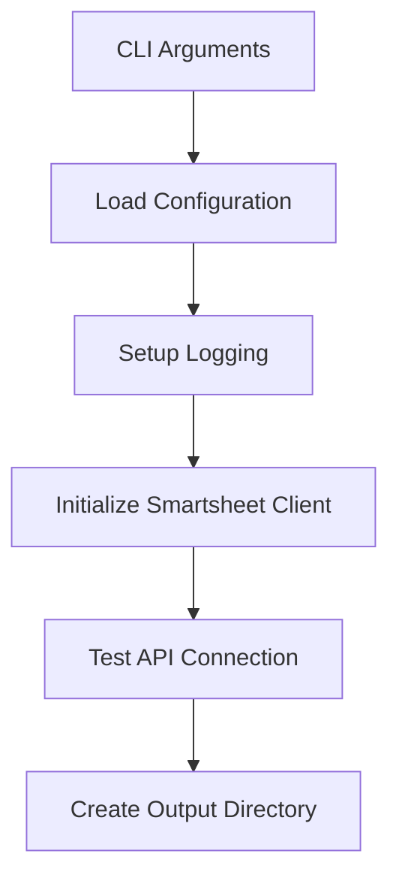
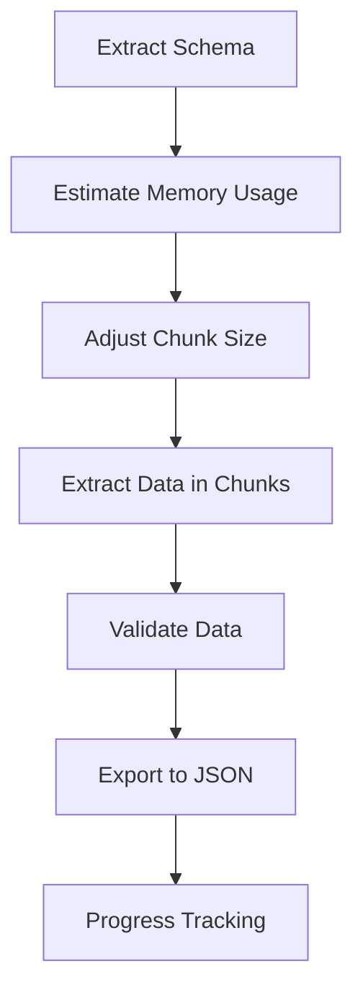
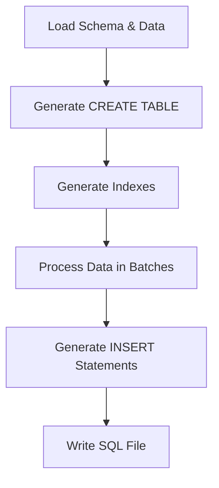

# ss2db Developer Guide

A comprehensive guide for developers working with the ss2db (Smartsheet to Database) project.

## Table of Contents

- [Overview](#overview)
- [Architecture Deep Dive](#architecture-deep-dive)
- [Development Setup](#development-setup)
- [Core Components](#core-components)
- [Data Flow](#data-flow)
- [Extension Points](#extension-points)
- [Testing Strategy](#testing-strategy)
- [Performance Considerations](#performance-considerations)
- [Security Guidelines](#security-guidelines)
- [Debugging & Troubleshooting](#debugging--troubleshooting)
- [Contributing](#contributing)

## Overview

ss2db is a production-ready command-line tool that extracts data from Smartsheet and generates SQL import scripts for PostgreSQL and MySQL databases. The tool is designed for handling large datasets (90K+ rows) with robust error handling, rate limiting, and memory management.

### Key Design Principles

- **Separation of Concerns**: Clear boundaries between API client, data processing, and database generation
- **Type Safety**: Comprehensive type hints with Pydantic models and dataclasses
- **Error Resilience**: Robust error handling with retry logic and graceful degradation
- **Performance**: Memory-efficient streaming with configurable chunking
- **Extensibility**: Plugin-friendly architecture for new database types and data sources

## Architecture Deep Dive

### High-Level Architecture

```
┌─────────────────┐    ┌─────────────────┐    ┌─────────────────┐
│   CLI Layer     │    │  Configuration  │    │    Logging     │
│   (main.py)     │◄──►│   (config.py)   │◄──►│ (utils/logging) │
└─────────────────┘    └─────────────────┘    └─────────────────┘
         │
         ▼
┌─────────────────┐    ┌─────────────────┐    ┌─────────────────┐
│  Data Sources   │    │  Data Models    │    │  File Handlers  │
│  (smartsheet/)  │◄──►│   (models.py)   │◄──►│ (utils/files.py)│
└─────────────────┘    └─────────────────┘    └─────────────────┘
         │
         ▼
┌─────────────────┐
│ Database Layer  │
│  (database/)    │
└─────────────────┘
```

### Module Structure

```
ss2db/
├── __init__.py           # Package initialization
├── __main__.py           # CLI entry point
├── main.py              # Core CLI logic and orchestration
├── config.py            # Configuration management
├── smartsheet/          # Smartsheet API integration
│   ├── __init__.py
│   ├── client.py        # API client with rate limiting
│   ├── extractors.py    # Data extraction logic
│   └── models.py        # Data models and schemas
├── database/            # Database SQL generation
│   ├── __init__.py
│   ├── postgresql.py    # PostgreSQL-specific logic
│   └── mysql.py         # MySQL-specific logic
└── utils/               # Utility modules
    ├── __init__.py
    ├── files.py         # File operations and management
    └── logging.py       # Logging configuration
```

## Development Setup

### Prerequisites

- Python 3.12+
- pip or uv package manager
- Git
- Docker (optional, for database testing)

### Quick Start

```bash
# Clone the repository
git clone https://github.com/your-org/ss2db.git
cd ss2db

# Install in development mode
pip install -e ".[dev]"

# Install pre-commit hooks
pre-commit install

# Copy environment template
cp .env.example .env
# Edit .env with your Smartsheet API token

# Run tests
pytest

# Run the application
ss2db --help
```

### Development Dependencies

The project uses modern Python tooling for quality assurance:

```toml
[project.optional-dependencies]
dev = [
    "pytest>=7.4.0",         # Testing framework
    "pytest-cov>=4.1.0",     # Coverage reporting
    "black>=23.0.0",          # Code formatting
    "isort>=5.12.0",          # Import sorting
    "flake8>=6.0.0",          # Linting
    "mypy>=1.5.0",            # Type checking
    "pre-commit>=3.4.0",      # Git hooks
]
```

### Code Quality Tools

```bash
# Format code
black ss2db tests
isort ss2db tests

# Type checking
mypy ss2db

# Linting
flake8 ss2db

# Run all quality checks
pre-commit run --all-files
```

## Core Components

### 1. Smartsheet Client (`smartsheet/client.py`)

The API client handles all communication with Smartsheet's REST API.

**Key Features:**
- Rate limiting (100 requests/minute with configurable buffer)
- Exponential backoff retry logic
- Comprehensive error handling
- Session-based connection reuse

```python
class SmartsheetClient:
    def __init__(self, api_token: str, config: Optional[Dict[str, Any]] = None):
        self.api_token = api_token
        self.rate_limiter = RateLimiter(
            max_requests_per_minute=100,
            buffer_requests=config.get('rate_limit_buffer', 5)
        )
    
    def _make_request(self, method: str, endpoint: str, **kwargs) -> requests.Response:
        # Rate limiting, retry logic, and error handling
        pass
```

**Usage Example:**
```python
client = SmartsheetClient(api_token, config)
sheet_data = client.get_sheet(sheet_id, include_all=True)
```

### 2. Data Models (`smartsheet/models.py`)

Type-safe data models using dataclasses and enums.

**Core Models:**
- `SmartsheetColumn`: Column metadata with type mappings
- `SmartsheetCell`: Cell data with value transformation
- `SmartsheetRow`: Row container with cell lookup
- `SmartsheetSchema`: Complete sheet/report schema
- `ExtractionProgress`: Progress tracking for long operations

```python
@dataclass
class SmartsheetColumn:
    id: int
    title: str
    type: str  # Maps to ColumnType enum
    index: int
    primary: bool = False
    hidden: bool = False
    
    def get_postgres_type(self) -> str:
        """Convert to PostgreSQL data type."""
        return TYPE_MAPPING.get(self.type, "TEXT")
```

### 3. Data Extractors (`smartsheet/extractors.py`)

Handles data extraction with memory management and progress tracking.

**Key Features:**
- Memory-aware chunking
- Progress callbacks
- Data validation
- Generator-based streaming

```python
class SheetExtractor(SmartsheetExtractor):
    def extract_data(self, sheet_id: str, 
                    progress_callback: Optional[Callable] = None) -> Generator[List[SmartsheetRow], None, ExtractionProgress]:
        # Memory-efficient data extraction with chunking
        chunk_size = self._adjust_chunk_size(total_rows, column_count)
        
        for chunk in self._process_chunks(data, chunk_size):
            if progress_callback:
                progress_callback(progress)
            yield chunk
```

### 4. Database Generators (`database/`)

SQL generation for different database types.

**PostgreSQL Generator (`postgresql.py`):**
- JSONB support for complex types
- Proper SQL escaping
- Batch INSERT generation
- Index creation

**MySQL Generator (`mysql.py`):**
- JSON type support
- Engine and charset configuration
- Batch processing
- Constraint handling

```python
class PostgreSQLGenerator:
    def convert_column_type(self, column: SmartsheetColumn) -> str:
        """Convert Smartsheet column type to PostgreSQL type."""
        postgres_types = {
            ColumnType.TEXT_NUMBER: "TEXT",
            ColumnType.CHECKBOX: "BOOLEAN",
            ColumnType.CONTACT_LIST: "JSONB" if self.use_jsonb else "JSON",
            # ... more mappings
        }
        return postgres_types.get(column.type, "TEXT")
```

### 5. Configuration Management (`config.py`)

Hierarchical configuration system with validation.

**Configuration Hierarchy:**
1. Command-line arguments (highest priority)
2. Environment variables
3. YAML configuration file
4. Default values (lowest priority)

```python
class Config(BaseModel):
    smartsheet: SmartsheetConfig = Field(default_factory=SmartsheetConfig)
    output: OutputConfig = Field(default_factory=OutputConfig)
    database: DatabaseConfig = Field(default_factory=DatabaseConfig)
    processing: ProcessingConfig = Field(default_factory=ProcessingConfig)
    logging: LoggingConfig = Field(default_factory=LoggingConfig)
    advanced: AdvancedConfig = Field(default_factory=AdvancedConfig)
```

## Data Flow

### 1. Initialization Phase



### 2. Data Extraction Phase



### 3. SQL Generation Phase



## Extension Points

### Adding a New Database Type

1. **Create Database Module**: `ss2db/database/newdb.py`

```python
class NewDBGenerator:
    def __init__(self, config: Optional[Dict[str, Any]] = None):
        self.config = config or {}
    
    def convert_column_type(self, column: SmartsheetColumn) -> str:
        # Map Smartsheet types to NewDB types
        pass
    
    def generate_create_table_sql(self, schema: SmartsheetSchema, table_name: str) -> str:
        # Generate CREATE TABLE statement
        pass
    
    def generate_insert_sql_batch(self, rows: List[Dict], schema: SmartsheetSchema) -> str:
        # Generate INSERT statements
        pass

def generate_newdb_script(data_file: Path, schema_file: Path, 
                         output_file: Path, config: Dict) -> Dict[str, Any]:
    generator = NewDBGenerator(config)
    sql_content = generator.generate_complete_sql(data_file, schema_file)
    # Write and return stats
```

2. **Update Configuration**: Add NewDB config class to `config.py`

3. **Update Main CLI**: Add NewDB option to `main.py`

### Adding a New Data Source

1. **Create Extractor**: `ss2db/newsource/extractor.py`

```python
class NewSourceExtractor(BaseExtractor):
    def extract_schema(self, source_id: str) -> SmartsheetSchema:
        # Extract schema from new source
        pass
    
    def extract_data(self, source_id: str) -> Generator[List[SmartsheetRow], None, ExtractionProgress]:
        # Extract data with chunking and progress
        pass
```

2. **Update Models**: Extend data models if needed

3. **Update CLI**: Add new source options

### Custom Data Transformations

```python
class CustomTransformer:
    def transform_cell_value(self, value: Any, column: SmartsheetColumn) -> Any:
        # Custom transformation logic
        if column.type == ColumnType.CUSTOM_TYPE:
            return self.custom_transform(value)
        return value
```

## Testing Strategy

### Test Structure

```
tests/
├── __init__.py
├── test_client.py         # API client tests
├── test_models.py         # Data model tests
├── test_postgresql.py     # PostgreSQL generator tests
├── test_mysql.py          # MySQL generator tests
├── test_extractors.py     # Extractor tests
├── test_config.py         # Configuration tests
└── fixtures/              # Test data
    ├── sample_sheet.json
    ├── sample_schema.json
    └── expected_sql/
```

### Test Categories

1. **Unit Tests**: Individual component testing
2. **Integration Tests**: Component interaction testing
3. **API Tests**: Mock Smartsheet API responses
4. **SQL Generation Tests**: Verify correct SQL output
5. **Configuration Tests**: Validate config loading and validation

### Running Tests

```bash
# Run all tests
pytest

# Run with coverage
pytest --cov=ss2db --cov-report=html

# Run specific test file
pytest tests/test_client.py

# Run specific test
pytest tests/test_client.py::TestRateLimiter::test_wait_if_needed
```

### Test Example

```python
class TestSmartsheetClient:
    def setup_method(self):
        self.client = SmartsheetClient("test_token", {
            'retry_attempts': 3,
            'rate_limit_buffer': 5
        })
    
    @patch('requests.Session.request')
    def test_rate_limiting(self, mock_request):
        # Test rate limiting behavior
        mock_response = Mock()
        mock_response.status_code = 429
        mock_response.headers = {'Retry-After': '60'}
        mock_request.return_value = mock_response
        
        with pytest.raises(SmartsheetAPIError):
            self.client._make_request('GET', '/test')
```

## Performance Considerations

### Memory Management

The application uses several strategies to handle large datasets efficiently:

1. **Chunked Processing**: Data is processed in configurable chunks
2. **Memory Estimation**: Automatic chunk size adjustment based on memory limits
3. **Generator Pattern**: Streaming data processing without loading everything into memory
4. **Garbage Collection**: Explicit cleanup of large objects

```python
def _adjust_chunk_size(self, total_rows: int, column_count: int) -> int:
    memory_per_chunk = self._estimate_memory_usage(self.chunk_size, column_count)
    if memory_per_chunk > self.memory_limit_mb:
        adjusted_chunk_size = int((self.memory_limit_mb / memory_per_chunk) * self.chunk_size)
        return max(100, adjusted_chunk_size)  # Minimum chunk size
    return self.chunk_size
```

### API Rate Limiting

The rate limiter uses a sliding window algorithm for efficient API usage:

```python
class RateLimiter:
    def wait_if_needed(self) -> float:
        now = time.time()
        cutoff = now - self.window_seconds
        self.request_times = [t for t in self.request_times if t > cutoff]
        
        if len(self.request_times) >= self.effective_limit:
            wait_until = self.request_times[0] + self.window_seconds
            wait_time = max(0, wait_until - now)
            if wait_time > 0:
                time.sleep(wait_time)
                return wait_time
        
        self.request_times.append(now)
        return 0.0
```

### SQL Generation Optimization

- **Batch Processing**: Generate INSERT statements in configurable batches
- **String Building**: Efficient string concatenation for large SQL files
- **Type Mapping**: Pre-computed type mappings for fast conversion

## Security Guidelines

### API Token Management

- **Environment Variables**: Store tokens in environment variables, never in code
- **Configuration Files**: Exclude sensitive config files from version control
- **Logging**: Never log API tokens or sensitive data

```python
def get_api_token(self) -> str:
    token = (
        self._env_vars.get("SMARTSHEET_API_TOKEN") or
        self._env_vars.get("SS_API_TOKEN")
    )
    if not token:
        raise ValueError("API token not found. Set SMARTSHEET_API_TOKEN environment variable.")
    return token
```

### SQL Injection Prevention

```python
def escape_string(self, value: str) -> str:
    """Escape string value for PostgreSQL."""
    escaped = value.replace("'", "''")      # Escape single quotes
    escaped = escaped.replace("\\", "\\\\")  # Escape backslashes
    return escaped
```

### Input Validation

```python
def _validate_row_data(self, row: SmartsheetRow, schema: SmartsheetSchema) -> bool:
    try:
        for cell in row.cells:
            column = schema.get_column_by_id(cell.column_id)
            if not column:
                continue
            
            # Validate data types and constraints
            if column.type == ColumnType.CHECKBOX and cell.value is not None:
                if not isinstance(cell.value, bool):
                    # Attempt conversion or reject
                    pass
        return True
    except Exception as e:
        self.logger.error(f"Validation error: {e}")
        return False
```

## Debugging & Troubleshooting

### Logging Configuration

The application provides comprehensive logging with multiple levels:

```python
# Enable debug logging
ss2db --sheet-id 123 --verbose

# Write logs to file
ss2db --sheet-id 123 --log-file export.log

# Quiet mode (errors only)
ss2db --sheet-id 123 --quiet
```

### Common Issues

1. **Rate Limiting**: Increase `rate_limit_buffer` in config
2. **Memory Issues**: Reduce `chunk_size` or increase `memory_limit_mb`
3. **API Errors**: Check token validity and permissions
4. **SQL Errors**: Validate data types and constraints

### Debug Mode

```python
# Enable detailed API logging
import logging
logging.getLogger('ss2db.smartsheet.client').setLevel(logging.DEBUG)

# Monitor memory usage
import psutil
process = psutil.Process()
memory_mb = process.memory_info().rss / 1024 / 1024
```

### Performance Profiling

```python
# Profile specific operations
import cProfile
import pstats

profiler = cProfile.Profile()
profiler.enable()

# Your code here

profiler.disable()
stats = pstats.Stats(profiler)
stats.sort_stats('cumulative').print_stats(20)
```

## Contributing

### Development Workflow

1. **Fork & Clone**: Fork the repository and clone your fork
2. **Branch**: Create a feature branch (`git checkout -b feature/new-feature`)
3. **Develop**: Make changes following the coding standards
4. **Test**: Run the full test suite and add tests for new features
5. **Quality**: Run code quality tools (black, mypy, flake8)
6. **Commit**: Use conventional commit messages
7. **Pull Request**: Submit a PR with detailed description

### Coding Standards

- **Type Hints**: All functions must have type hints
- **Docstrings**: Use Google-style docstrings
- **Error Handling**: Comprehensive error handling with logging
- **Testing**: 80%+ test coverage required
- **Performance**: Consider memory and performance implications

### Commit Message Format

```
feat: add support for SQLite database generation
fix: resolve memory leak in data extraction
docs: update API documentation
test: add integration tests for MySQL generator
refactor: simplify configuration validation logic
```

### Pull Request Checklist

- [ ] Tests pass and coverage maintained
- [ ] Code quality checks pass (black, mypy, flake8)
- [ ] Documentation updated
- [ ] CHANGELOG.md updated
- [ ] Performance impact considered
- [ ] Security implications reviewed

## Advanced Topics

### Custom Configuration Providers

```python
class CustomConfigProvider:
    def load_config(self) -> Dict[str, Any]:
        # Load from custom source (database, API, etc.)
        pass

# Use in config.py
def load_config_from_provider(provider: CustomConfigProvider) -> Config:
    config_data = provider.load_config()
    return Config(**config_data)
```

### Plugin Architecture

```python
class DatabasePlugin:
    def get_name(self) -> str:
        return "custom_db"
    
    def get_generator_class(self) -> Type[BaseGenerator]:
        return CustomDBGenerator
    
    def get_config_class(self) -> Type[BaseModel]:
        return CustomDBConfig

# Register plugins
def register_database_plugin(plugin: DatabasePlugin):
    DATABASE_PLUGINS[plugin.get_name()] = plugin
```

### Async Processing

For future enhancement, consider async patterns:

```python
import asyncio
import aiohttp

class AsyncSmartsheetClient:
    async def get_sheet_async(self, sheet_id: str) -> Dict[str, Any]:
        async with aiohttp.ClientSession() as session:
            async with session.get(f"/sheets/{sheet_id}") as response:
                return await response.json()
```

This developer guide provides comprehensive information for working with the ss2db codebase. For specific implementation details, refer to the inline documentation and test files.